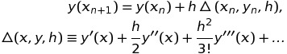
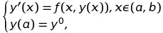

# Лабораторная работа № 7. Безусловный экстремум.

Выполнил студент группы 429
Турбылев Михаил Сергеевич

## Вариант № 17
Задание билета: Решить методом Тейлора 2-го порядка задачу Коши

с заданной относительной точностью 0,01.
Требуется построение графиков решения , а также фазовых траекторий.

## Теоретическая часть
**Метод разложения в ряд Тейлора**
Простейшим способом построения приближенного решения в точке  сетки  является способ, основанный на разложении решения в ряд Тейлора в предыдущей точке сетки  по степеням шага ***h***:

Взяв вместо этого ряда конечный его отрезок

и заменяя в нем производные  в силу дифференциального уравнения 

получаем последовательность приближений

Отсюда, в частности, при ***p = 1*** получаем схему

(метод Эйлера), а при ***p = 2*** - схему

## Практическая часть

Последовательность запуска: компиляция части программы на с++, ее запуск, затем запускаем часть на python. 

### Результаты
В результате работы программы задача Коши  

была решена методом Тейлора 2-го порядка с заданной относительной точностью 0,01. Ниже приведены графики решения , а также фазовые траектории.

.png) .png) .png)
